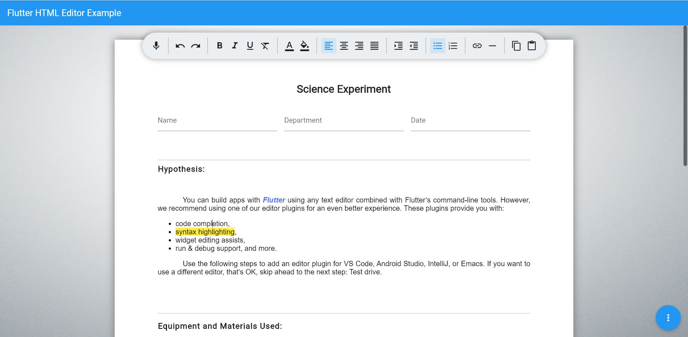
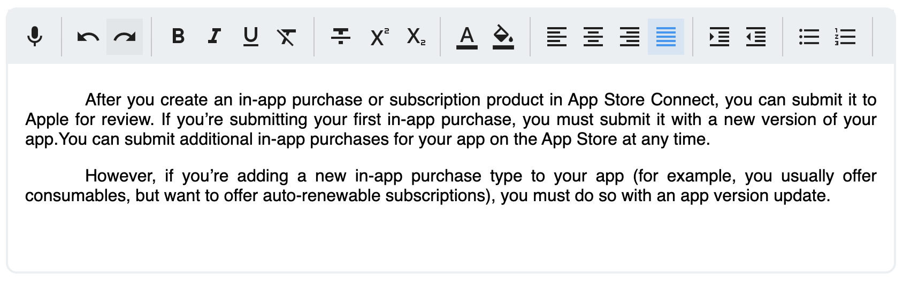
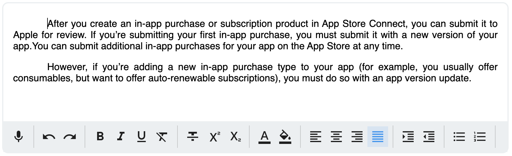
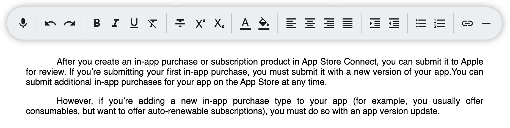
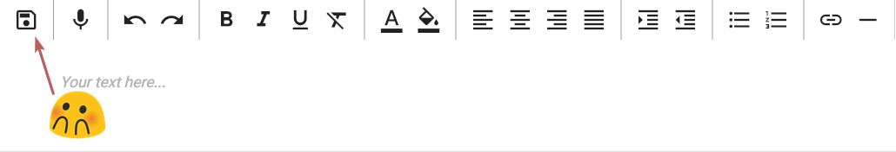

<!-- 
This README describes the package. If you publish this package to pub.dev,
this README's contents appear on the landing page for your package.

For information about how to write a good package README, see the guide for
[writing package pages](https://dart.dev/guides/libraries/writing-package-pages). 

For general information about developing packages, see the Dart guide for
[creating packages](https://dart.dev/guides/libraries/create-library-packages)
and the Flutter guide for
[developing packages and plugins](https://flutter.dev/developing-packages). 
-->

# Flutter Rich Text Editor

Rich text editor for Flutter with built-in voice-to-text.
Try it [here](https://flutter-rich-text.web.app/).



____


## Under the Hood
This WYCIWYG HTML editor easy to use and provides **great flexibility and control over the generated HTML.**

This plugin is a reworked [html_editor_enhanced](https://github.com/tneotia/html-editor-enhanced) with the following key differences:
 * Vertical auto-sizing to content size with height change notifier
 * ***Summernote*** and ***jQuery*** **replaced** with [Squire](https://github.com/neilj/Squire) and [DOMPurify](https://github.com/cure53/DOMPurify) for HTML5 compatibility, features, performance and size.
 * [in_app_webview](https://pub.dev/packages/in_app_webview) replaced with Flutter's own [webview_flutter](https://pub.dev/packages/webview_flutter).


____

## Basic Implementation

Basic implementation of this editor doesn't require a controller. For simplicity and eas of use, [HtmlEditor] gives you access to the following top-level attributes:

- height,
- minHeight,
- hint,   
- initialValue,  
- onChanged,
- isReadOnly, 
- enableDicatation


```Dart
import 'package:flutter_rich_text_editor/flutter_rich_text_editor.dart';

// ...

// 1. Define a var to store changes within parent class or a provider etc...
String result = 'Hello world!';

// ...

// 2. Add HtmlEditor to your build method
@override
Widget build(BuildContext context) =>
    HtmlEditor(initalValue: result, onChanged:(s)=> result = s ?? '');

```

____


## Advanced Implementation

To take advantage of the entire API you'll need to create and configure an instance of [HtmlEditorController]. That instance provides access to the following groups of features:

 * **Styling options** group (all things CSS, HTML and sanitizing)
 * **Toolbar options** group (all things toolbar)
 * **Editor options** group (all things editor)


____

    
### HTML Styling Options

The `stylingOptions` parameter of [HtmlEditorController] class defines the look of generated HTML. Here you can select which tag to use for paragraphs and how your tags are styled.

```Dart

var stylingOptions = HtmlStylingOptions(

    // Adding global style is optional, but could be set in two ways:
    // 1. by providing a CSS string to the parameter `globalStyleSheet`:
    globalStyleSheet: '/* Your CSS string contents of style.css file */',

    // This defines which tag to use for paragraphs.
    // The default value is `p`, however the `div` is also acceptable.
    blockTag: 'p',

    // defines `style` and `class` attributes of a block tag
    blockTagAttributes: HtmlTagAttributes(

        // this is added as inline CSS for every tag
        inlineStyle: 'text-indent:3.5em; text-align:justify;',

        // defines `class` attribute value of every tag
        cssClass: 'my-custom-pgf'),

    // next we can define attributes for other tags (li, ul, ol, a etc):
    li: HtmlTagAttributes(
        inlineStyle: 'margin: .5em 1em  .5em .5em',
        cssClass: 'my-custom-li-class'),

    // ... other HTML tag definitions ... //

    code: HtmlTagAttributes(
        inlineStyle: 'padding: .5em 1em;', cssClass: 'my-custom-li-class'),

    // when sanitizeOnPaste is `true` - editor will strip all 
    // HTML pasted into the editor down to plain text
    sanitizeOnPaste: true,
    );

    // 2. another way to add global CSS is to call this async method:
    await stylingOptions.importCssFromFile('path/to/style.css');

    // ...

    // Now create the editor passing the styling options
    return HtmlEditor(
      controller: HtmlEditorController(stylingOpitons: stylingOptions),
      onChanged: (p0) => (p0) {/* TODO */},
      initialValue: '' /* TODO */,
    );
```

The code above should result in the following HTML being generated for each paragraph:

```html

<p style="text-indent:3.5em; text-align:justify;" class="my-custom-pgf"></p>

```

### Sizing and Constraints

By default widget is trying to occupy all available width and sizes its height based on the height of its content, but not less than the value of `minHeight` attribute of [HtmlEditor] widget.

```Dart
    // since explicit height is not provided - the editor will size itself
    // based on content, but will be not less than 250px
    return HtmlEditor(
      controller: controller,
      // ...
      minHeight: 250, // should be not less than 64px
      // ...
    );

    // and here you can listen to changes in height of the editor
    ValueListenableBuilder<double>(
        builder: (BuildContext context, double value, Widget? child) {
        return Text('Height changed to $value px');
        },
        valueListenable: controller.contentHeight);
    
```

<br />
If explicit `height` is provided - the widget will size it's height precisely to the value of `height` attribute. In this case, if content height is greater than the widget height - the content becomes scrollable.

```Dart
    // here we've provided the height value, so the editor will always be
    // that height and the content will scroll if overflows the height.
    return HtmlEditor(
      height: 250,
    );
```

____


### Toolbar Position

All toolbar-related options are contained within [ToolbarOptions] of [HtmlEditorController] class. Toolbar could be positionned:

 * __above__, __below__ the editor container, by setting the `toolbarPosition` attribute;


#### Above editor:



#### Below editor:



 * __detached__ from the editor and located anywhere outside the [HtmlEditor]widget. This allows [ToolbarWidget] to be attached to several HtmlEditors. For this type of implementation please refer to the example within the package. 
 

 * _scrollable_, _grid_ or _expandable_ by setting the `toolbarType` attribute


____


### Toolbar Contents and Custom Button Groups

Toolbar button groups could be enabled/disabled via `defaultToolbarButtons` attribute of [HtmlToolbarOptions] class within the controller. You can customize the toolbar by overriding the default value of this attribute.
<br /><br />
Adding your own button groups to the toolbar is very simple - just provide a list of [CustomButtonGroup] objects to the `customButtonGroups` attribute. Each button group will consist of a list of [CustomToolbarButton] objects, each with its own icon, tap callback and an `isSelected` flag to let the toolbar know if the icon button should be highlighted.


```Dart
HtmlEditor(
    controller: HtmlEditorController()
        ..toolbarOptions!.customButtonGroups = [
        CustomButtonGroup(
            index: 0, // place first
            buttons: [
            CustomToolbarButton(
                icon: Icons.save_outlined,
                action: () => /* TODO: implement your save method */,
                isSelected: false)
        ])
        ],
    ),
```
=



____


### Voice to Text (Dictation)

Voice-to-text feature is powered by [speech_to_text](https://pub.dev/packages/speech_to_text) package and comes enabled by default with this package.
To disable voice-to-text feature - set the corresponding top-level `enableDictation` attribute within [HtmlEditor] constructor to `false`.

____

## Special Considerations 

Following needs to be done to make things work on each platform:

### Android

For speech recognition to work - place this to `android > app > src > main > AndroidManifest.xml`

```xml

<manifest xmlns:android="http://schemas.android.com/apk/res/android"
    package="com.example.example">

    <uses-permission android:name="android.permission.RECORD_AUDIO" />
    <uses-permission android:name="android.permission.BLUETOOTH" />
    
   <application
    ...
```

### iOS
For speech recognition to work - add following permission to your `Info.plist` file:
```xml
<key>NSSpeechRecognitionUsageDescription</key>
<string>recognize speech</string>
<key>NSMicrophoneUsageDescription</key>
<string>Need microphone access for uploading videos</string>
```

### Web Platform

To get the toolbar to scroll horizontally on Web, you will need to make sure you override the default scroll behavior:

1. Add the following class override to your app:
    ```Dart
    class MyCustomScrollBehavior extends MaterialScrollBehavior {
    @override
    Set<PointerDeviceKind> get dragDevices => {
            PointerDeviceKind.touch,
            PointerDeviceKind.mouse,
        };
    }

    ```

2. Add the following attribute to the [MaterialApp] widget:

    ```Dart
    return MaterialApp(
        // ...
        scrollBehavior: MyCustomScrollBehavior(),
        // ...
    );

    ```

Done. Now you should be able to drag the toolbar left and right on web.


